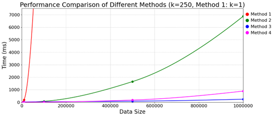
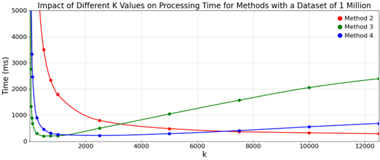

# 2024Fall-OS-HW1-Sorting

## Description

This project implements Assignment 1: performance comparison of four sorting methods (Method 1–4). The program will:

1. Prompt the user to enter the input file name (without the `.txt` extension).
2. Load non-negative integers (one per line) from `<FileName>.txt`.
3. Display a menu to choose a sorting method (1–4).
4. For Methods 2–4, prompt for the number of partitions `K`.
5. Execute the chosen method, measure CPU time, and verify the result.
6. Write sorted data and performance metrics to `<FileName>_output<MethodNumber>.txt`.

## Usage

1. **Development Environment**: Windows Subsystem for Linux (WSL2)

   * **Linux Subsystem**: Ubuntu 22.04.3 LTS

2. **Compiler**: g++ (Ubuntu 11.3.0-1ubuntu1\~22.04) 11.3.0

3. **Compile**

   ```bash
   g++ -std=c++17 -O2 main.cpp -o main
   ```

4. **Run**

   ```bash
   ./main
   ```

   Then follow the interactive prompts:

   ```text
   Input file name: input_10w
   ********           Sort           ********
   * 1.bubble sort                          *
   * 2.bubble merge sort                    *
   * 3.bubble merge sort with multiprocess  *
   * 4.bubble merge sort with multithread   *
   ******************************************
   Input a command (1, 2, 3, 4): 2
   Enter the number of partitions (1~1000000): 5
   writing...
   Complete!
   ```

## I/O Format

* **Input files** (placed at test_data/input):

  * `input_1w`   (10,000 integers)
  * `input_10w`  (100,000 integers)
  * `input_50w`  (500,000 integers)
  * `input_100w` (1,000,000 integers)
  * Each file: one non-negative integer per line, no header.

* **Output file**:

  * Name: `<InputFile>_output<MethodNumber>.txt` (e.g., `input_10w_output2.txt`)
  * Contents:

    ```text
    <sorted numbers...>
    CPU Time: <time> ms
    Output Time: YYYY-MM-DD HH:MM:SS.<mmm>+08:00
    ```

## Example Session

```bash
$ ./sort_hw1
Input file name: input_10w
********           Sort           ********
* 1.bubble sort                          *
* 2.bubble merge sort                    *
* 3.bubble merge sort with multiprocess  *
* 4.bubble merge sort with multithread   *
******************************************
Input a command (1, 2, 3, 4): 2
Enter the number of partitions (1~1000000): 5
writing...
Complete!
```

Check `input_10w_output2.txt`:

```text
12
34
56
...
99999
CPU Time: 1234.567890 ms
Output Time: 2024-11-21 15:30:45.123+08:00
```

## Chart Analysis



### Figure 1. Execution Time vs Data Size


  As the data size increases from 10,000 to 1,000,000 elements, Method 1 (pure Bubble Sort) shows a rapid, non-linear growth in execution time due to its O(n²) complexity. Method 2 (Bubble Merge Sort) improves performance significantly for smaller sizes but still degrades as chunks grow larger. Methods 3 and 4 (multiprocessing and multithreading) maintain much lower execution times across all sizes, with multiprocessing slightly outperforming multithreading at larger scales, likely due to reduced contention in shared memory accesses.
  


### Figure 2. Execution Time vs Partition Count (N = 500,000)

  For a fixed dataset of 500,000 elements, increasing the number of partitions k for Method 2 significantly reduces execution time up to an optimal point, after which the overhead of merging many small chunks causes slight increases. Method 3 (multiprocessing) exhibits an optimal range around k = 250\~1000, beyond which additional process overhead outweighs parallel gains. Method 4 (multithreading) quickly reaches low execution times when k > 50 and remains stable, as thread overhead and memory contention balance out.

## Development Environment

* **Platform**: Windows 10 + WSL2
* **Linux Subsystem**: Ubuntu 22.04.3 LTS
* **Compiler**: g++ (Ubuntu 11.3.0-1ubuntu1\~22.04) 11.3.0

---

*Ensure the input file exists as `<FileName>.txt` before running. The program will append `.txt` internally.*
